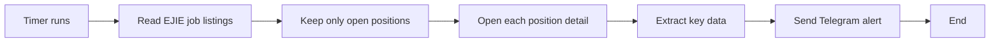
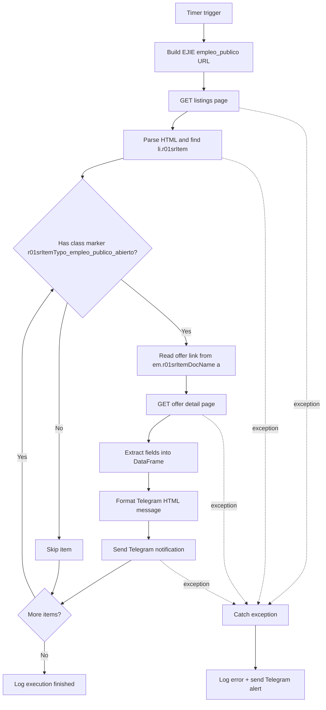

## EJIE Azure Function

This project is a timer-triggered Azure Function that monitors EJIE public job postings.

On each run, it:
- Opens the EJIE listings page
- Detects open offers
- Reads each offer detail page and extracts the main information
- Sends a formatted notification to a Telegram chat

If something fails, it logs the error and sends an alert message to Telegram.

Required environment variables: `TIMER_SCHEDULE`, `BASE_URL`, `TELEGRAM_BOT_TOKEN`, `TELEGRAM_CHAT_ID`.

## Flow

EJIE is the Basque Government IT organization (Sociedad Informatica del Gobierno Vasco). This function watches its public jobs board and only processes open postings.

### Quick Flow

### Detailed Flow

